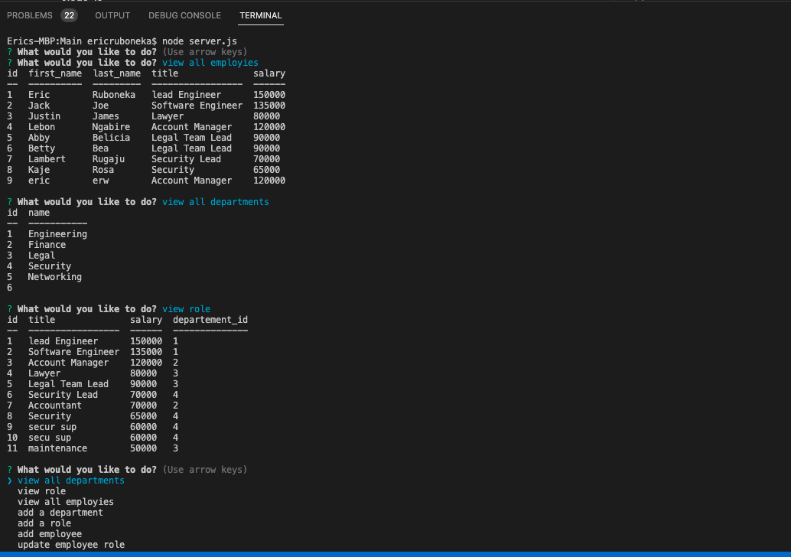

## EMPLOYEE_DBTRACKER

### Description

This is a terminal application that is connected to the database called employee_db.
by using this application you can view all employies, add new employee, view all roles, add new role, view all departements and add new departements.

### NPM packages

* Inquirer
* mysql2 
* Console.table

### Technologies

* Node Js
* Mysql

### License

> This application does not have license

### Link
Click on the following link to open on github repo.

* [GitHub](https://github.com/raphson1/employee_DbTrackEr)

### Image

[Video](./Main/img/Screen%20Recording%202022-06-17%20at%2012.31.24%20PM.zip)

